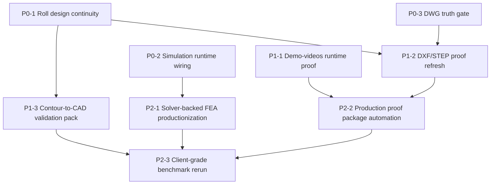

# COPRA Gap -> Execution Plan (Strict Audit Mode)

**Date:** 2026-04-04  
**Source baseline:** `COPRA_GAP_ANALYSIS_2026-04-04.md`  
**Runtime note:** This plan is generated from source inspection. Runtime execution is still pending in this shell environment.

---

## 1. P0 blockers that prevent honest COPRA-class positioning

### P0-1 Roll design correctness: flower -> contour -> CAD continuity
- Why it matters:
  - If flower output is not consumed by contour and export paths, tooling remains non-trustworthy.
  - This is the core blocker for any honest roll-tooling claim.
- Exact files/modules involved:
  - `artifacts/python-api/app/engines/advanced_flower_engine.py`
  - `artifacts/python-api/app/engines/roll_contour_engine.py`
  - `artifacts/python-api/app/engines/roll_design_calc_engine.py`
  - `artifacts/python-api/app/engines/cam_prep_engine.py`
  - `artifacts/python-api/app/engines/cad_export_engine.py`
- Proof required:
  - 5 difficult sample profiles.
  - Per-station contour payloads (top/bottom) persisted.
  - DXF/STEP artifacts showing contour-driven geometry.
  - Station-wise deviation table (target vs generated contour).
- Success condition:
  - Flower pass plan is consumed in contour schedule.
  - CAD exports use contour payloads in main path.
  - No station truncation.
- Failure condition:
  - Placeholder cylinder/circle geometry in main export path.
  - Unused flower pass plan.
  - Missing station-level contour evidence.

### P0-2 Simulation runtime wiring + truthful mode separation
- Why it matters:
  - Current posture must remain honest: precheck is not full FEA.
  - Runtime wiring must prove which mode executed.
- Exact files/modules involved:
  - `artifacts/python-api/app/engines/simulation_engine.py`
  - `artifacts/python-api/app/engines/advanced_process_simulation.py`
  - `artifacts/python-api/app/engines/fea/fea_pipeline.py`
  - `artifacts/python-api/app/engines/fea/fea_routes.py`
  - `artifacts/python-api/app/api/routes.py`
- Proof required:
  - `/api/simulate` run logs and outputs.
  - `/api/fea/solver-status` output.
  - `/api/fea/run` result with either `SOLVED` evidence or explicit `EXTERNAL_SOLVER_REQUIRED`.
  - Saved result artifacts and parser output.
- Success condition:
  - Precheck and solver-backed outputs are explicitly separated and labeled.
  - No endpoint/UI path labels precheck as full FEA.
- Failure condition:
  - Any full-FEA claim without solver-backed runtime artifacts.

### P0-3 DWG truth gate: real support or explicit disablement
- Why it matters:
  - DWG overclaim is a trust-breaker and sales-risk blocker.
- Exact files/modules involved:
  - `artifacts/python-api/app/engines/cad_export_engine.py`
  - `artifacts/python-api/app/engines/oss_cad_stack_engine.py`
  - `artifacts/python-api/app/api/routes.py`
- Proof required:
  - API responses confirming `dwg_export_supported: false` unless real backend exists.
  - Export manifests showing only proven formats.
  - If DWG backend added, actual `.dwg` file + open validation proof.
- Success condition:
  - DWG remains explicitly unsupported until backend + artifacts are proven.
- Failure condition:
  - DWG success is shown without backend and runtime artifact.

---

## 2. P1 upgrades that improve capability but do not unblock truth claims

### P1-1 Demo-videos runtime proof (React #300 stability)
- Why it matters:
  - Demo route stability affects credibility and validation flow.
- Exact files/modules involved:
  - `artifacts/design-tool/src/pages/Home.tsx`
  - `artifacts/design-tool/src/components/cnc/DemoVideoCenter.tsx`
- Proof required:
  - Route load + hard refresh proof.
  - 5-10 tab switches without React #300.
  - 60-second idle playback without hook-order error.
- Success condition:
  - No overlay/console hook-order error across repeated switches.
- Failure condition:
  - Any recurring React #300 or blank/unstable scene.

### P1-2 DXF/STEP proof refresh with contour traceability
- Why it matters:
  - Export integrity is required for engineering handoff.
- Exact files/modules involved:
  - `artifacts/python-api/app/engines/cad_export_engine.py`
  - `artifacts/python-api/app/engines/export_dxf_engine.py`
  - `artifacts/python-api/app/engines/export_step_engine.py`
  - `artifacts/python-api/tests/test_export_regression.py`
  - `artifacts/python-api/tests/test_production_grade_suite.py`
- Proof required:
  - New run artifacts (DXF/STEP), not stale evidence.
  - DXF parse check (`ezdxf`), STEP format check.
  - Contour presence per sample stations.
- Success condition:
  - Fresh artifact set passes structural and contour checks.
- Failure condition:
  - Missing, stale, or non-parseable exports.

### P1-3 Sample profile contour-to-CAD validation pack
- Why it matters:
  - Bridges implementation evidence to user-facing engineering proof.
- Exact files/modules involved:
  - `artifacts/python-api/app/engines/roll_contour_engine.py`
  - `artifacts/python-api/app/engines/cad_export_engine.py`
  - `artifacts/python-api/scripts/stage1_generate_20_cases.py`
- Proof required:
  - At least 5 hard profiles with station-wise contour snapshots.
  - Input -> flower -> contour -> CAD trace for each case.
- Success condition:
  - Reproducible profile pack with artifact index and status per case.
- Failure condition:
  - Incomplete chain evidence or repeated placeholder outputs.

---

## 3. P2 long-horizon modules

### P2-1 Solver-backed FEA productionization
- Why it matters:
  - Needed for advanced physics credibility beyond precheck.
- Exact files/modules involved:
  - `artifacts/python-api/app/engines/fea/fea_pipeline.py`
  - `artifacts/python-api/app/engines/fea/deck_writer.py`
  - `artifacts/python-api/app/engines/fea/result_importer.py`
  - `artifacts/python-api/app/engines/fea/material_cards.py`
- Proof required:
  - Multi-pass solved runs with imported stress/strain/springback fields.
  - Benchmark reproducibility with archived solver logs.
- Success condition:
  - Stable solver-backed runbook and repeatable result import path.
- Failure condition:
  - Architecture exists but no reproducible solved runs.

### P2-2 Production proof package automation
- Why it matters:
  - Audit and client readiness require repeatable evidence packaging.
- Exact files/modules involved:
  - `artifacts/python-api/scripts/stage1_generate_20_cases.py`
  - `artifacts/python-api/COPRA_EVIDENCE_PACKAGE.md`
  - `artifacts/python-api/COPRA_AUDIT_REPORT_v2_2.md`
- Proof required:
  - Automated generation of artifact index + failure analysis + scorecard.
- Success condition:
  - One-command reproducible evidence bundle for current commit.
- Failure condition:
  - Manual/stale documentation not tied to fresh run.

### P2-3 Client-grade benchmark rerun
- Why it matters:
  - Converts architecture maturity into customer-safe capability claims.
- Exact files/modules involved:
  - `artifacts/python-api/tests/test_production_profiles.py`
  - `artifacts/python-api/tests/test_production_grade_suite.py`
  - `artifacts/python-api/COPRA_GAP_ANALYSIS_2026-04-04.md`
- Proof required:
  - Approved benchmark set run against current commit.
  - Pass/fail matrix with measured deviations and export outcomes.
- Success condition:
  - Updated benchmark report with evidence paths and honest scoring.
- Failure condition:
  - Claims not backed by benchmark rerun artifacts.

---

## 4. Execution details (dependencies, proof checklist, readiness)

### 4.1 Dependency graph

### 4.2 Proof checklist (strict)

- P0 checklist:
  - Flower -> contour -> CAD trace exists for each selected sample.
  - Simulation output explicitly states precheck vs solver-backed mode.
  - DWG status is truthful and artifact-backed.
- P1 checklist:
  - Demo-videos route stable under repetition and idle conditions.
  - Fresh DXF/STEP artifacts parse and match contour evidence.
  - Sample-profile validation pack includes per-station artifacts.
- P2 checklist:
  - Solver-backed FEA runs are reproducible.
  - Evidence package generation is automated and repeatable.
  - Benchmark rerun report is tied to commit hash + artifacts.

### 4.3 Final verdict on current readiness

- Current readiness: **Near COPRA-class architecture, not COPRA-equivalent proof**.
- Claim ceiling right now: **PARTIAL / NOT VERIFIED** for COPRA-equivalent positioning.
- Reason:
  - Core architecture is present and improving.
  - Runtime proof chain is still incomplete for critical modules (especially solver-backed FEA and full production evidence refresh).

